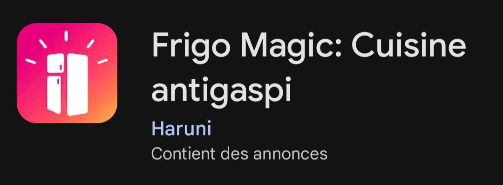
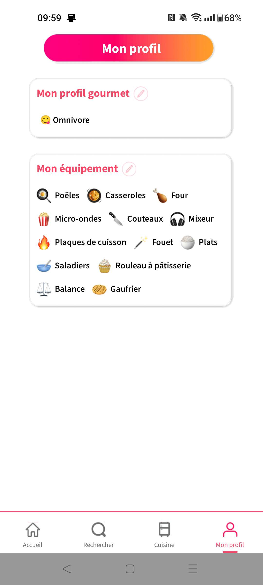
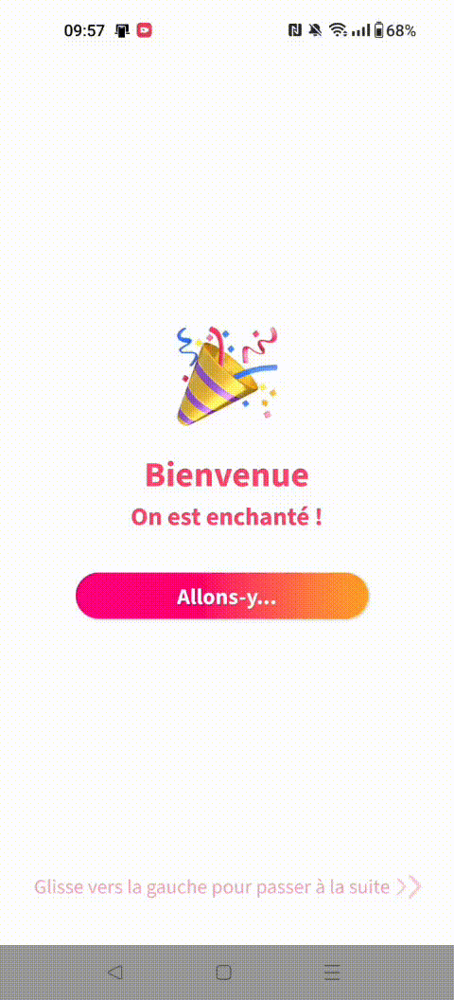
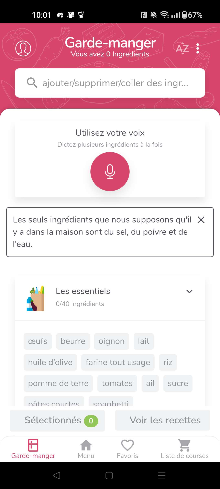
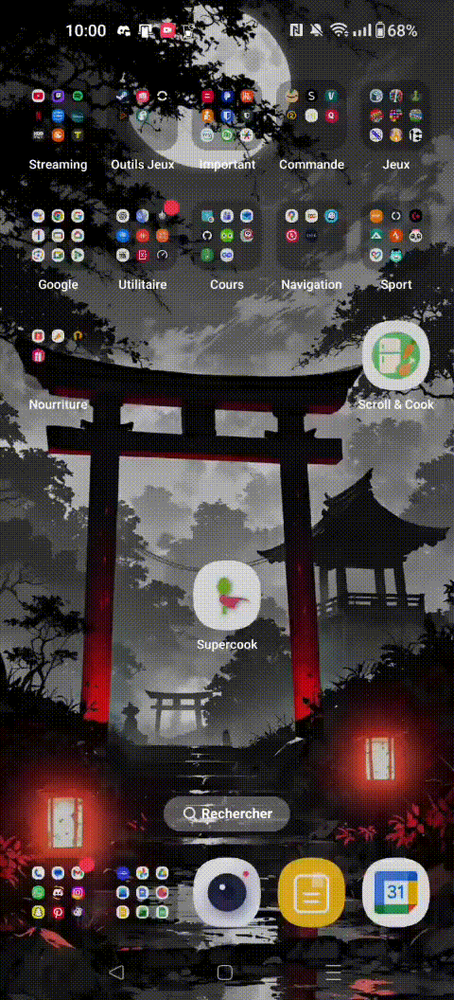
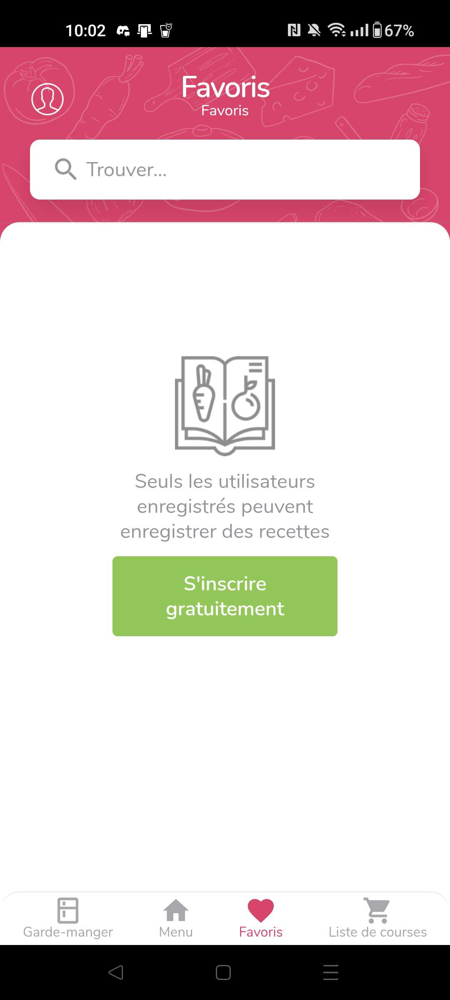
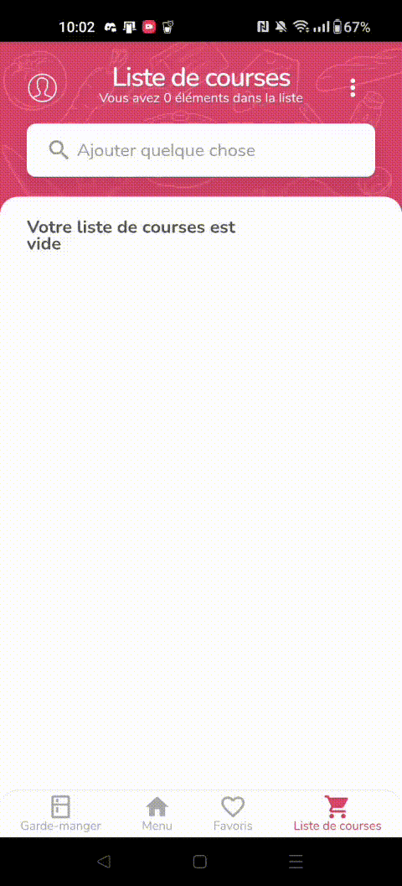
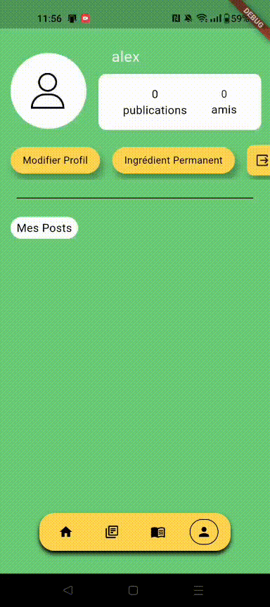

# 🍳 Scroll & Cook
> S&C : Ouvre ton frigo, on trouve ta recette !


## 📋 Table des Matières :

1. [📜 Description](#-description-)
2. [📝 Contexte](#-contexte-)
3. [🚀 Présentation](#-présentation-)
4. [🏗️ Structure du projet](#%EF%B8%8F-structure-)
5. [🔍 Étude de l'existant](#-étude-de-lexistant-)
6. [🎯 Public Cible](#-public-cible-)
7. [⚙️ Fonctionnalités de l'application](#%EF%B8%8F-fonctionnalités-de-lapplication-)
8. [👤 User Stories](#-user-stories-)
9. [🎥 Vidéo Présentation](#-vidéo-présentation-)
10. [⏳ État d'avancement](#-état-davancement-)
11. [🧩 Compilation/Installation](#-compilationinstallation-)
12. [📁 Ressources](#-ressources-)
13. [📒 Notes](#-notes-)
14. [🏷️ Crédits](#%EF%B8%8F-crédits-)

## 📜​ Description :

Toujours en manque d’inspiration lorsque vous cuisinez ? Ou encore l’éternelle question que les enfants posent, “Maman qu’est ce qu’on mange ce soiiiir ?” **Scroll & Cook** est une application qui vous permettra de répondre à cette question ! La manière de l’utiliser est simple comme bonjour, la fonction primaire de cette application se nomme "fond de frigo". Elle vous permettra de choisir les ingrédients à votre disposition comme le type de viande (bœuf, porc etc…), le type de légume ou même de féculent. Nous vous proposerons les recettes les plus populaires et les mieux notées, mais pas que, car vous allez également pouvoir tester des recettes créées de toute pièce par d’autres utilisateurs ayant eu un élan d’inspiration pour en réaliser une. Cela signifie que même vous, vous pourrez en créer une ! Et vous pourrez vous aussi les partager au monde entier sur notre réseau social créé à cet effet.


## 📝 Contexte :

Dans le cadre du cours de développement mobile en Flutter de 3e année, nous avons été amenés à réaliser une application qui résolvait un problème ou qui avait une utilité quelconque. Nous étions d'abord parti sur l'idée d'une application qui pourrait aider la personne qui l'utilise à trouver une activité à faire autour d'elle quand elle s'ennuie, grâce à un système de géolocalisation et de notation en fonction des avis utilisateurs. Mais nous nous sommes heurter à un mur quand nous avons appris que certains de nos camarades ont eu une idée presque similaire. Pendant une discussion banale, nous avons pensé à un problème auquel tout le monde à déjà été confronter : "Qu'est ce qu'on mange ce soir ?". C'est de là qu'est venu notre idée de faire une application qui génère des recettes en fonction de ce qu'il y a dans le frigo de l'utilisateur de celle ci.

## 🚀 Présentation :

Scroll & Cook est une application mobile qui a pour but d’aider les utilisateurs à trouver des idées de repas lorsqu’ils ne savent pas quoi cuisiner. Elle permet de proposer des recettes en fonction des ingrédients disponibles, afin d’éviter de perdre du temps à chercher ou de devoir faire des courses inutiles.

La fonctionnalité principale de l’application est le fond de frigo. Elle permet à l’utilisateur de sélectionner les ingrédients qu’il a à sa disposition pour ensuite obtenir une liste de recettes correspondantes. Ces recettes peuvent être consultées librement et enregistrées pour être retrouvées plus tard.

L’application propose également la possibilité de créer ses propres recettes. L’utilisateur peut les garder pour lui ou les partager avec les autres membres de l’application. Un système de réseau social permet d’échanger autour des recettes, de commenter les publications et de sauvegarder celles qui plaisent.

Scroll & Cook peut être utilisée sans compte afin de consulter certaines recettes, mais la création d’un compte est nécessaire pour accéder à l’ensemble des fonctionnalités proposées par l’application et profiter pleinement de l’expérience utilisateur

## 🏗️ Structure :

### Voici la structure du code du projet :

```
scroll_and_cook/
│
├── code/
│   ├── dto/
│   │   └── lib/
│   │       ├── converter/
│   │       └── model/
│   ├── push_data_firestore/
│   │   ├── lib/
│   │   │   ├── data/
│   │   │   ├── screens/
│   │   │   └── styles/
│   └── scroll_and_cook/
│       ├── lib/
│       │   ├── routes/
│       │   ├── screens/
│       │   ├── styles/
│       │   ├── util/
│       │   └── widgets/
│       │       ├── builder/
│       │       ├── button/
│       │       ├── create_recette_screen/
│       │       ├── icon/
│       │       ├── input
│       │       ├── list_view/
│       │       ├── profile_screen/
│       │       └── social_screen/
│       └── assets/
│           ├── icons/
│           └── img/
│
├── maquettes/
│   ├── Page Lancement.png
│   ├── Page Login.png
│   ├── ...
│
├── resources/
│   ├── img/
│   ├── icons/
│   
├── docs/
│   ├── gif/
│   ├── image/
│
└── README.md 
```
- Le dossier `code` contient le code source de l'application
- Dans le dossier `maquettes` se trouvent les ressources graphiques
- Le dossier `resources` contient toutes les ressources graphiques nécessaires à l'application, telles que les logos, images de fond, icônes, polices de caractères, ...
- Le dossier `docs` contient les ressources utilisées pour la documentation

### 🌐​ DTO

```
    ├── dto
    │   └── lib/
    │       ├── converter/
    │       ├── model/
    |       └── schema.dart
```
- Le dossier `dto` contient le modèle de la base de données défini dans `schema.dart`
- Le dossier `model` contient modèle des entités
- Le dossier `converter` contient un convertisseur utilisé pour les dates dans la base de données

### 💾​ PUSH DATA FIRESTORE (SEEDER)

```
│   ├── push_data_firestore/
│   │   ├── lib/
│   │   │   ├── data/
│   │   │   ├── screens/
│   │   │   └── styles/
```
- Le dossier `push_data_firestore` est utilisé pour ajouter des données de base dans l'application
- Dans le dossier `lib` nous pouvons retrouver :
  - Le dossier `data` contenant les données qui seront "poussées" dans la base de données
  - On peut retouver toute la logique d'ajout et de suppression des données dans l'écran du dossier `screens`
  - Le dossier `styles` contient simplement le style utilisé dans l'application fenêtrée

### 📱 SCROLL AND COOK 

```
│   └── scroll_and_cook/
│       ├── lib/
│       │   ├── routes/
│       │   ├── screens/
│       │   ├── styles/
│       │   ├── util/
│       │   └── widgets/
│       │       ├── builder/
│       │       ├── button/
│       │       ├── create_recette_screen/
│       │       ├── icon/
│       │       ├── input/
│       │       ├── list_view/
│       │       ├── profile_screen/
│       │       └── social_screen/
│       └── assets/
│           ├── icons/
│           └── img/
```
- Le dossier `scroll_and_cook` contient l'entièreté du code de l'application Scroll & Cook
- Elle se divise en plusieurs dossiers dont `lib` qui contient :
  - Les routes de l'application dans le dossier `routes`
  - Le dossier `screens` contient tout les écrans différents de l'application
  - Le style qui y est lié se trouve dans `styles`
  - Le dossier `util` contient des fonctions utilitaires qui ne sont pas des widgets ou des screens
  - Le dossier `widgets` contient les différents widgets refactorisé utiliser dans l'application
    - Le dossier `builder` contient des implémentations de FuturBuilder ou de StreamBuilder
    - Les boutons sont dans le dossier `button`
    - Certains dossiers contiennent les widgets associés à l'écran cité dans leur nom, comme `create_recette_screen`, `profile_screen` ou encore `social_screen`
    - On peut retrouver différents widgets qui dynamise les icônes dans `icon`
    - Le dossier `input` contient, quant à lui, toutes une séries de zones de saisies différentes
    - Enfin, les lists views se trouvent dans le dossier `list_view`
- Un autre dossier est `assets` qui contient les différentes images `img` et icônes `icons` utilisées dans l'application

## 🔍 Étude de l'existant :

Il existe plusieurs applications qui proposent des fonctionnalités simialires à **Scroll & Cook** sur le marché actuelle des applications. Nous pouvons en citer quelques unes :

### 🍎​ Frigo Magic :

   <p>
      
   </p>

<ins>Cette application propose plusieurs fonctionnalités similaires comme :</ins>
- L'équivalent de notre *fond de frigo* qui propose des recettes en fonction des ingrédients à notre portée. La différence avec notre application réside dans le fait que les recettes sont proposées dynamiquement au fur et à mesure que l'on ajoute des ingrédients. Cela pourrait être une piste d'amélioration pour notre application
  <p>
      
  </p>
- Un catalogue avec des recettes proposées dynamiquement. Nous avons une fonctionnalités simialire dans notre application qui peut être accédée avec ou sans compte.
  <p>
      
  </p>
- L'équivalent de nos *ingrédients permanents* qui permet d'ajouter des ingrédients que nous avons toujours chez nous ou presque. La différence par rapport à **Scroll & Cook** est qu'il y a une échelle (*Toujours*, *Parfois*, *Jamais*) accompagné de chaque ingrédients pour préciser à quelle fréquence ils sont présent chez nous.
  <p>
      
  </p>
- Un profil qui comporte beaucoup moins de fonctionnalités que notre application. Frigo Magic propose moins de possibilité de customisation de profil qui pourrait ajouter un plus à l'expérience utilisateur.
  <p>
      
  </p>

<ins>Cette application propose aussi plusieurs fonctionnalités différentes comme :</ins>
- Une personnalisation de l'expérience de l'application quand on arrive sur dessus pour la première fois. On peut préciser différentes informations comme notre alimentation, notre sexe ou encore le nombre de personnes qui composent notre ménage, qui permettront de filtrer les résultats obtenu lors de la recherche de recette.
  <p>
      
  </p>

### 🍐​ Supercook :

   <p>
      
   </p>

<ins>Cette application propose plusieurs fonctionnalités similaires comme :</ins>
- L'équivalent de notre *fond de frigo* qui propose des recettes en fonction des ingrédients à notre portée. Supercook à renommé cette fonctionnalité *garde mangé* et propose une fonctionnalité de saisie micro des ingrédients
   <p>
      
      
  </p>
- Une connexion sans compte beaucoup plus fournie en fonctionnalités que **Scroll & Cook**. Cette fonctionnalité est forcée dès l'entrée sur l'application pour la première fois parce qu'il n'y a pas de proposition de se connecter sur un écran d'accueil ou autre. Nous avons accès a presque l'entièreté de l'application sans avoir créer de compte au préalable
  <p>
      
      <p>
         Par contre la seule limite se présente quand nous voulons enregistrer une recette. C'est à ce moment là qu'une connexion est demandée.
         <p>
            
         </p>
     </p>
  </p>

<ins>Cette application propose aussi plusieurs fonctionnalités différentes comme :</ins>
- Une liste de course qui permet d'ajouter ou de supprimer des ingrédients qu'il faudrait qu'on achète. C'est une fonctionnalitée simple dans l'idée mais elle n'est pas présente dans Scroll & Cook
  <p>
      
  </p>

## 🎯 Public Cible :

Le public cible de l’application **Scroll & Cook** sont des personnes qui cuisinent régulièrement ou occasionnellement et qui manquent d’inspiration pour leurs repas du quotidien.

L’application s’adresse aux personnes souhaitant découvrir de nouvelles recettes, partager leurs créations et échanger avec une communauté.

## ⚙️ Fonctionnalités de l'application :

> **Scroll & Cook** présente de nombreuses fonctionnalités qui vont être citées ci dessous.

### 👤 Connexion sans compte :

Tout d'abord nous pouvons parler de la connexion sans compte qui peut être utilisée depuis l'écran d'acceuil en cliquant sur *Continuer sans compte*. Cette fonctionnalité permet à l'utilisateur d'accéder seulement aux recettes qui viennent de sortir et ou aux recettes populaires de l'application. Si l'utilisateur veut accéder aux autres fonctionnalités, il faudra qu'il se connecte.

### 🔐 Connexion avec compte :

Ce n'est pas une fonctionnalité extraordinaire en tant que tel mais comme l'application propose une connexion sans compte, il est important de préciser qu'elle en a une avec compte. L'inscription se réalise à l'aide de la saisie du nom d'utilisateur, de l'adresse mail et du mot de passe. Seulement l'adresse mail et le mot de passe seront utilisé à nous pour la connexion. Celle-ci permettra d'accéder à l'entièreté de l'application

### 📚 Catalogue : 

Comme cité au dessus, quand on arrive sur l'application, l'utilisateur est accueilli par un catalogue contenant les recettes récemment sorties ainsi que les recettes populaires auprès des autres utilisateurs de l'application. Il peut rechercher des recettes à l'aide d'une barre de recherche ou se contenter des recettes affichées. L'appui sur une recette lui permet de l'afficher en grand et de, s'il le souhaitons, l'enregistrer dans ses recettes personnelles

C'est sur cette page que l'utilisateur peut accéder à la fonctionnalité phare de l'application, le *fond de frigo*

### 🍽️ Fond de Frigo :

Cette fonctionnalité permet à l'utilisateur de rechercher des recettes en fonction de ce qu'il y a dans son frigo. Les recettes affichées pourront, s'il le désire, être sauvegardées dans son catalogue personnel

Il pourra ajouter des ingrédients de type :
- Viande
- Légumineuse
- Féculent
- Fruit
- Épice

### ❤️ Catalogue Personnel :

C'est là que seront affichée les recettes enregistrées ainsi que les recettes créée par l'utilisateur. Comme pour le catalogue basique, il pourra cliquer sur les recettes pour les afficher en grand et réalisé différentes choses dessus :
- Pour les recettes qu'il aura créé, il pourra la *poster sur le réseau social*, la *modifier* ou la *supprimer*
- Pour les recettes qu'il a simplement enregistré, il pourra seulement la retirer de ses favoris ou non

Sur cet écran, il pourra aussi utiliser la fonctionnalité de *création de recette* qui lui permet, comme indiqué dans le nom, de créer une recette lui même.

### ✍️ Création de recette :

C'est ici que l'utilisateur pourra donner libre cours à son imagination et mettre en place une recette par lui même. Il pourra déterminer les moindres détails de celle ci :
- Le titre
- L'image qui pourra être choisie en fonction d'image prédéfinie
- Le nombre de personne
- Les ingrédients ainsi que leurs quantités
- Les étapes de la recettes
- La difficulté

Lors de l'enregistrement de sa création, la recette sera ajoutée à son catalogue personnel et il sera redirigé vers la recette ainsi créée et il pourra réaliser les diverses opérations déjà citée au dessus

### 🌐 Réseau social :

L'utilisateur aura donc la possibilité de poster ses recettes sur un réseau social où il partagera l'espace avec les autres utilisateurs de l'application. Chaque *post* peut être : 
- Liker (une seule fois par utilisateur) en cliquant sur le pouce ou en double cliquant sur l'image de celui ci
- Commenter en cliquant sur la petite icône. L'utilisateut pourra aussi consulter les commentaires déjà écrit depuis cette fenêtre de dialogue
- Partager à un amis en cliquant sur la flèche d'envoi
- Enregistrer en cliquant sur la bannière. La recette sera placée dans le catalogue personel

Si l'utilisateur est curieux ou qu'il veut demander l'auteur du post en amis, il pourra accéder à son profil en cliquant sur l'image de profil, ce qui le redirigera vers le profil correspondant. S'il veut ajouter une personne en particulier dont il connait le nom, il pourra le rechercher dans la barre de recherche en cliquant sur l'icône de la loupe en haut de son écran. Il pourra aussi accéder à ses messages depuis cette page en cliquant sur l'icône de phylactère 

### 🪪 Profil :

L'utilisateur peut accéder à son profil pour voir son nombre de publications, d'amis et ses posts. Il pourra, s'il le souhaite, modifier sa photo de profil en cliquant dessus ou modifier son nom d'utilisateur en cliquant sur le bouton lié. Il pourra aussi, depuis son profil toujours, ajouter des *ingrédients permanents* qui sont des ingrédients qu'il aura toujours chez lui comme par exemple du sel, poivre, huiles, ...

L'utilisateur peut accéder au profil d'un autre utilisateur où il pourra voir les mêmes informations que sur son profil et pourra, en plus, l'ajouter en amis et lui envoyer un message. Si l'utilisateur A ajoute l'utilisateur B en amis, A et B pourront ouvrir une conversation, s'envoyer des messages et se partager des recettes présentent sur le réseau social. 

Il pourra aussi accéder à la page de la recette en cliquant sur le post qui l'intéresse.

Si l'utilisateur veut changer de compte, il pourra se déconnecter et réutiliser les fonctionnalités de connexion ou d'inscription

### 💬 Message :

En fonction de l'endroit d'où il vient, l'utilisateur pourra envoyé un message directement à un de ses amis en passant par son profil ou ouvrir une conversation en passant par l'icône de message sur le réseau social. Il pourra échanger à l'écrit mais aussi partager des recettes postée sur le réseau social pour que son amis puisse les voir aussi.

Si aucune conversation n'est existante, l'utilisateur pourra appuyer sur le *+* pour en ajouter une. Sinon, il pourra simplement cliquer sur la conversation qui lui convient.

## 👤 User Stories :

Voici les user stories *Sans Connexion* :

1. **Authentification** *(nouvel utilisateur)* :
   - [ ] Je peux continuer sans avoir besoin de créer ou de me connecter à un compte.
   <p>
      
   </p>

1. **Accès au catalogue** *(personne non-connectée)* :
   - [ ] Je peux visualiser les recettes populaires et les dernières recettes arrivées du catalogue.
   - [ ] Je peux passer à un affichage plus détaillé pour les recettes du catalogues pour afficher des informations comme les ingrédients ou le temps de préparation en plus des infos de base.
   <p>
      
   </p>
   
   
   - [ ] Je peux rechercher des recettes à l’aide d’une barre de recherche.
   <p>
      
   </p>

Aucun accès aux autres fonctionnalités avec la connexion sans compte : 
*Génération de recettes, Accès au réseau social, Accès aux recettes persos, Partage de recettes, Création de recettes, Accès au profil*


Voici les user stories *Avec Connexion* : 

1. **Authentification** *(nouvel utilisateur)*

- [ ] Je peux créer un compte en utilisant mon adresse mail et mon mot de passe.
   <p>
      
   </p>
- [ ] Je peux me connecter en utilisant mon adresse mail et mon mot de passe.
   <p>
      
   </p>
   
2. **Accès au catalogue** *(personne connectée)*

- [ ] Je peux visualiser les recettes populaires du catalogue.
- [ ] Je peux passer à un affichage plus détaillé pour les recettes du catalogues pour afficher des informations comme les ingrédients ou le temps de préparation en plus des infos de base.
   <p>
      
   </p>
- [ ] Je peux rechercher des recettes à l’aide d’une barre de recherche.
   <p>
      
   </p>
- [ ] Je peux afficher la recette complète et l’enregistrer si j’ai envie de la retrouver facilement plus tard.
   <p>
      
   </p>
- [ ] Je peux accéder à la fonctionnalité de recherche de recettes en fonction des aliments contenus dans mon frigo.

3. **Génération de recettes** *(personne connectée)*

- [ ] Je dois renseigner les ingrédients présent dans mon frigo à l’aide de catégorie prédéfinie
- [ ] J’accède aux recettes trouvées ou générées en fonction des ingrédients
- [ ] Je peux afficher une recette complète et l’enregistrer si j’ai envie de la retrouver facilement plus tard.
   <p> 
      
      
   </p>

4. **Accès au réseau social** *(personne connectée)*

- [ ] Je peux visualiser les recettes partagées par les autres utilisateurs de l’application
- [ ] Je peux, si je le souhaite, liker, commenter, partager ou enregistrer la publication
   <p>
      
      
   </p>
- [ ] Je peux rechercher d’autres utilisateurs et, si je le souhaite, les ajouter en amis
- [ ] Je peux échanger avec mes amis en accédant à la messagerie de l’application
   <p>
      
      
   </p>

5. **Accès aux recettes persos** *(personne connectée)*

- [ ] Je peux accéder, à tout moment, à mes recettes enregistrées et à mes recettes que j’ai créées auparavant.
- [ ] Je peux décider de créer une recette par moi même.
   <p>
      
   </p>
6. **Gestion des recettes persos** *(personne connectée)*

- [ ] Je peux, si je le souhaite, modifier ou supprimer une de mes recettes.
   <p>
      
   </p>
7. **Partage de recettes** *(personne connectée et ayant créé au moins une recette)*

- [ ] Je peux accéder à mes recettes créées et je peux décider de les partager sur le réseau social
   <p>
      
   </p>
8. **Création de recettes** *(personne connectée)*

- [ ] Je peux créer une recette en ajoutant les ingrédients en fonction du nombre de personnes, les étapes à suivre et une image du résultat final.
- [ ] Je peux ajouter, si je le souhaite, une estimation de la durée de réalisation ainsi qu’une difficulté de réalisation.
- [ ] Je peux décider, si je le souhaite, de partager ma recette sur le réseau social.
   <p>
      
      
   </p>
9. **Accès au profil** *(personne connectée)*

- [ ] Je peux accéder à mon profil pour regarder mon nombre d’amis, mes recettes partagées ainsi qu’à mes informations de compte
- [ ] Je peux modifier mon nom d’utilisateur ou ma photo de profil
- [ ] Je peux indiquer des “ingrédients permanents” qui pourront être choisis en dehors des aliments que j’ai dans mon frigo lors de la génération de recette. Ce sont des ingrédients qui seront toujours présents chez moi.
   <p>
      
   </p>


### 🎥 Vidéo Présentation : 
   <p>
      
   </p>


## ⏳ État d'avancement :

1. ✅​ **Implémentation de la page d'accueil** *13/11/25 (finalisation le 19/11/25)*

   - <ins>Travail réalisé :</ins>
      - [x] Création de l'écran d'accueil
      - [x] Refactorisation en widget
      - [x] Améliorer le visuel

    <p>
       
    </p>

2. ✅​ **Implémentation de la page de connection** *17/11/25 (finalisation le 29/12/25)*

   - <ins>Travail déjà réaliser :</ins>
      - [x] Création de l'écran de login
      - [x] Création du Widget TextInput et PasswordInput
      - [x] Faire les Validator
      - [x] Ajouter lien créé compte
      - [x] Vérification BD

    <p>
       
    </p>

3. ✅​**Implémentation de l'écran catalogue** *17/11/25 (finalisation le 02/01/26)*
   - <ins>Travail déjà réaliser :</ins>
      - [x] List des recette Populaire
      - [x] List des recette récente
      - [x] Redirection vers recette détailler
      - [x] Bouton Fond de frigo
      - [x] Input de recherche de recette

    <p>
       
    </p>

4. ✅​**Implémentation de l'écran Fond de frigo** *19/11/25 (finalisation le 02/01/26)*
   - <ins>Travail déjà réaliser :</ins>
      - [x] List des ingrédient
      - [x] Algo de recherche
      - [x] Affichage des resultats
      - [x] Choix entre tout les types d'ingrédient

    <p>
       
    </p>

5. ✅​ **Implémentation de la page d'inscription** *20/11/25 (mis à jour le 03/12/25 et finalisation le 29/12/25*

   - <ins>Travail réalisé :</ins>
      - [x] Création de l'écran d'inscription
      - [x] Ajout des inputs nécessaires
      - [x] Refactorisation en widget
      - [x] Lien avec la base de données

    <p>
       
    </p>

6. ✅​ **Implémentation des DTO** *03/12/25 (mis à jour plusieurs fois par la suite)*

   - <ins>Travail réalisé :</ins>
      - [x] Implémentation des modèles de collection
      - [x] Implémentation du schéma de base de données

7. ✅​ **Implémentation des écran de recherche d'ami et de recette** *10/12/25 (mis à jour plusieurs fois par la suite et fini le 2/01/26)*
   - <ins>Travail réalisé :</ins>
      - [x] Implémentation des modèles de collection
      - [x] Implémentation du schéma de base de données
    <p>
       
       
    </p>
    
8. ✅​ **Implémentation de l'écran de profil** *13/12/25 (mis à jour le 24/12/25 et finalisation le 29/12/25)*

   - <ins>Travail réalisé :</ins>
      - [x] Création de l'écran du profil
      - [x] Ajout des différents composants
      - [x] Lien avec la base de données
      - [x] Utilisation de FuturBuilder
      - [x] Ajout des posts de l'utilisateur
      - [x] Possibilité de modifier la photo de profil et le nom d'utilisateur avec une fenêtre de dialogue
      - [x] Implémentation d'un TypeAheadField pour les ingrédients premanents
      - [x] Implémentation du logout
      - [x] Implémentation de l'ajout en amis et de l'envoie de message
    <p>
       
    </p>
    
9. ✅​ **Implémentation de la messagerie** *14/12/25 (finalisation le 28/12/25)*
      - [x] creation conversation
      - [x] Button redirect vers la recherche ami
      - [x] List de nos conversation
      - [x] Organisation des messages
      - [x] Envoie de recette poster

10. ✅​ **Implémentation de la page de création de recette** *14/12/25 (finalisation le 27/12/25)*

   - <ins>Travail réalisé :</ins>
      - [x] Création de l'écran de création de recette
      - [x] Ajout des inputs nécessaires
      - [x] Implémentation d'un TypeAheadField pour les ingrédients
      - [x] Ajout de fenêtre de dialogue
      - [x] Utilisation de FuturBuilder
      - [x] Lien avec la base de données
      - [x] Récupération dynamique des ingrédients
      - [x] Refactorisation en widget
      - [x] Ajout de la possibilité de modifier une recette déjà existante
    <p>
        
        
    </p>
    
11. ✅​ **Implémentation du réseau social** *22/12/25 (finalisation le 29/12/25)*

   - <ins>Travail réalisé :</ins>
      - [x] Création de l'écran du réseau social
      - [x] Ajout de la structure d'un post
      - [x] Lien avec la base de données
      - [x] Utilisation de FuturBuilder et de StreamBuilder
      - [x] Implémentation de la redirection vers les messages, recherche ami et des profils
      - [x] Implémentation de la logique de like, commentaire, envoi et enregistrement
      - [x] Correction d'un bug permettant de liker plusieurs fois
    <p>
        
        
    </p>

12. ✅​ **Implémentation de la page de recette** *25/12/25 (finalisation le 29/12/25)*

   - <ins>Travail réalisé :</ins>
      - [x] Création de l'écran de recette
      - [x] Ajout des différents éléments
      - [x] Lien avec la base de données
      - [x] Chargement depuis la base de données à l'aide de l'id de la recette -> remplacement des paramètres
      - [x] Utilisation de FuturBuilder
      - [x] Ajout des icônes pour réaliser un CRUD sur la recette
      - [x] Implémentation de la logique du CRUD
      - [x] Ajout d'un bouton pour poster la recette
      - [x] Restriction des permissions pour les utilisateurs qui ne possèdent pas la recette
    <p>
        
    </p>

13. ✅​ **Implémentation du catalogue perso** *27/12/25*

   - <ins>Travail réalisé :</ins>
      - [x] Création de l'écran du catalogue perso sur base du catalogue déjà existant
      - [x] Lien avec la base de données
      - [x] Utilisation de FuturBuilder
    
14. ✅​ **Implémentation de push_data_firestore** *30/12/25 (mis à jour le 31/12/25 et finalisation le 04/01/26)*

    - <ins>Travail déjà réalisé :</ins>
      - [x] Ajout de données de base pour les users, les ingrédients, les recettes, les commentaires et des messages entre users
      - [x] Implémentation de méthodes pour générer des ids
      - [x] Ajout de la logique pour ajouter les données en base de données
      - [x] Permettre la suppression des données
      - [x] Lien de l'id de FirebaseAuth avec l'id de la base de données pour l'utilisateur pour éviter les bugs
      - [x] Suppression des utilisateurs dans FirebaseAuth pour éviter les erreurs de synchronisation avec la base de données

## 🧩 Compilation/Installation :

  0.  Prérequis : assurez-vous d'avoir installé Flutter et les dépendances requises sur votre système. Consultez la documentation officielle de Flutter pour les instructions d'installation spécifiques à votre système d'exploitation.
  1.  Ouvrir le terminal : ou une invite de commande dans le répertoire racine de votre projet (le répertoire qui contient le fichier pubspec.yaml).
  2.  Télécharger les dépendances : exécutez la commande flutter pub get pour récupérer toutes les dépendances spécifiées dans le fichier pubspec.yaml. Cela installera les packages requis pour l'application.
  3.  Exécuter l'application : utilisez la commande flutter run pour exécuter l'application sur un émulateur Android ou iOS ou sur un appareil physique connecté en mode développeur. Assurez-vous que l'émulateur ou l'appareil est configuré et prêt à être utilisé.

## 📁 Ressources : 

Notre Figma : https://www.figma.com/design/gs6fBfLwkTgy7aHNZ2CEXY/Maquette-Projet-Flutter?node-id=0-1&t=ZL9sqwtUCzGgyd7M-1 

## 📒​ Notes : 

> L'entièreté du README à été réalisé sans aide de l'intelligence artificielle

> L'icône de l'application a, par contre, été généré mais la couleur a été changée à la main

> Le slogan a été trouvé par nous et non pas par l'IA

## 🏷️ Crédits :

Application réalisée par : 
- Alexandre Fournier
- Noah Della Valle
